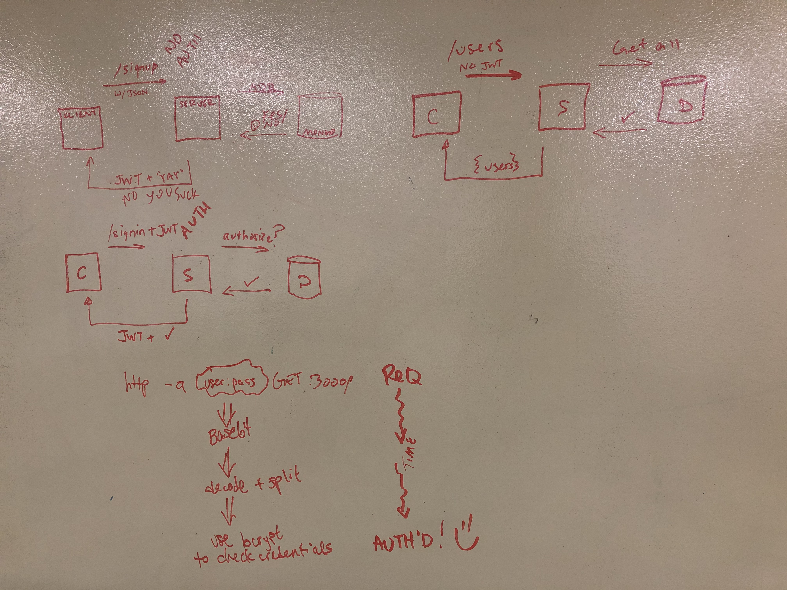

# JSON Server with Authentication and Permissions

### Description
JSON-serving API written in TypeScript with user authentication using JWT (JSON Web Token).

### Author: Tyler Sayvetz

## Links and Resources

- [Submission PR](https://github.com/tyler-401-advanced-javascript/Authenticated-Server/pull/2)
- Note yet hosted live


## Dependencies
  ```
    "@types/base-64": "^0.1.3",
    "@types/bcrypt": "^3.0.0",
    "@types/express": "^4.17.2",
    "@types/jsonwebtoken": "^8.3.7",
    "@types/mongoose": "^5.7.1",
    "@types/superagent": "^4.1.7",
    "base-64": "^0.1.0",
    "bcrypt": "^4.0.0",
    "dotenv": "^8.2.0",
    "express": "^4.17.1",
    "fs": "0.0.1-security",
    "https": "^1.0.0",
    "jest": "^25.1.0",
    "jsonwebtoken": "^8.5.1",
    "mongoose": "^5.9.2",
    "path": "^0.12.7",
    "superagent": "^5.2.2""

  ```

 ### Environment Variables Needed

- `PORT=3000`
- `MONGODB_URI=mongodb://localhost:27017/users`
- `SECRET=`{your app secret, an unguessable string}
- `LOCAL_OAUTH_ROUTE=` {your local oauth redirect route,  https://{your website}/{route}
- `FB_CLIENT_ID=`{your FB APP id}
- `FACEBOOK_APP_SECRET=`{your FB app's secret}

### How to initialize/run your application
The following assumes you have an installation of MongoDB. Refer to MongoDB docs if you need to install. 

1. Clone repo to local machine.

2. `cd` to repo

3. `npm init -y && npm i`

4. `npm run dev`

## API

### Public routes
>> `GET /users` >> returns all users in an array in body.

>> `GET /roles` >> returns all roles in an array in body.

### BasicAuth routes 
#### requiring 
>> `POST /signin` >> returns bearer token in body.

  add headers: `authorization: basic <username:password>` encoded base64.


### BearerAuth routes
#### requiring bearer token generated by the server to be included as the authorization header.
>> `POST /users | /roles` 

 used to create a new user or role. format body as follows: 

users: `{ username, password, role: <'user'|'admin'> }`

roles: `{ role, permissions: string[] }`
>> `PUT /users | /roles` 

update a user or role. Returns copy of thing you updated. Format the  Body:

users: ` this route not yet built `

roles: `{ roll: <roll name>, permissions: string[] }`

>>  `DELETE /user | /role` 

include the name of the user or the role to be deleted on the query string: `?name=<name>` or `?role=<name>`

returns: a copy of the resource you deleted.

### Tests

Testing to come.

### UML


Web RRC diagram for basic auth server, various routes.

